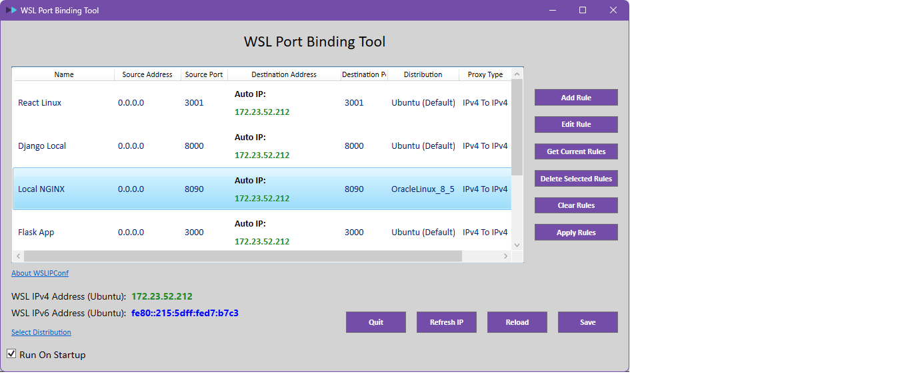

# WSLIPConf
__Auto Configure Port Forwarding From WSL for Windows Desktop (.NET 5.0)__

This program automatically detects the WSL IP address using the Linux _ip_ command, and sets up _netsh portproxy_ commands for the IPv4 address/port combinations.  

This is useful for running test projects in VS Code under WSL that serve and listen.  This will allow you to use your Windows-based browser or other front-end projects while running the back-end project in WSL.

Currently only V4ToV4 bindings are supported.

Just download the code, compile it, and start the project.  It should be relatively self-explanatory. 

__Alternatively: Binaries for x64 can be found in the (_binaries_)[https://github.com/nmoschkin/wslipconf/tree/main/binaries] folder.__

You might need to run 'git submodule init' and 'git submodule update' from the root of the project folder to grab the MessageBoxEx project.

If for any reason the window gets messed up and you can't fix it, go into the registry under __HKEY_CURRENT_USER\Software\Nathaniel Moschkin\WSLIPConf__ and delete the window geometry key.

## Sample Screens

### Main Screen

_(The accent color is detected from your Windows 8/10/11 color scheme)_

### Binding Configuration

_You can also set up port forwarding with addresses other than WSL. Just uncheck the 'Automatic WSL Destination' checkbox._

### About Box 

